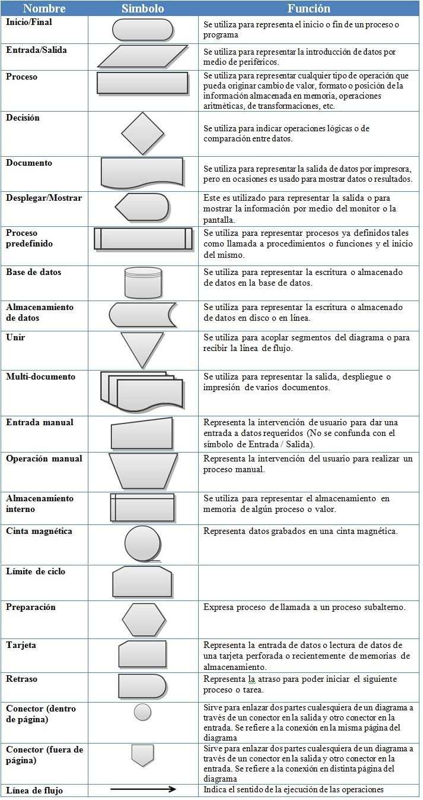
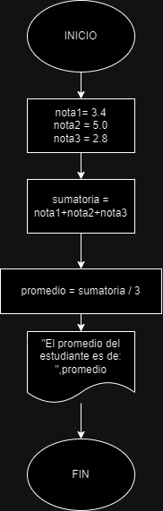

# Algoritmo (Cuantitativos y Cualitativos)

# Operadores

* Lógicos: `and`, `not`, `or`
* Aritméticos: `%(mod)`, `^`, `*`, `/`, `+`, `-` 
* Relacionales:`>`, `<`, `!=`, `==`, `>=`, `<=` 
* Elementos apoyo: `[]`, `{}`, `()`


## Palabras reservadas para crear Pseudocódigo

- `INICIO` * `FIN` 
- `DEFINIR` * `COMO`
- `ESCRIBA`
- `LEA` 
- `SI` * `ENTONCES` * `SINO` * `FIN SI`
- `PARA` * `FIN PARA`
- `HASTA` * `FIN HASTA`
- `MIENTRAS` * `FIN MIENTRAS`
- `HAGA`
- `CASO` * `DE` * `OTRO` * `FIN CASO`
- `FUNCION` * `RETORNE` * `FIN FUNCION`
- `PROCEDIMIENTO` * `FIN PROCEDIMIENTO`
- `REPETIR` * `HASTA_QUE`
- `SELECCIONAR` * `FIN SELECCIONAR`
- `ROMPER`
- `CONTINUAR`
- `ENCADENAR`
- `LARGO`
- `ANCHO`
- `CARACTER` * `ENTERO` * `REAL` * `BOOLEANO` * `CADENA` * `ARREGLO`
- `REGISTRO`
- `ARCHIVO`
- `LEER_ARCHIVO`
- `ESCRIBIR_ARCHIVO`
- `ABRIR_ARCHIVO`
- `CERRAR_ARCHIVO`

#### Nota: Una buena manera de diferenciar estas palabras, es escribirlas en mayúscula. 

## Ejemplo

#### Ej1 Obtener el promedio de tres notas y luego mostrar el resultados. 

```
    INICIO
        DECLARAR nota1, nota2, nota3, promedio, sumatoria COMO REAL
        
        nota1 <- 3.4
        nota2 <- 5.0
        nota3 <- 2.8
        
        sumatoria <- nota1+nota2+nota3
        promedio <- sumatoria/3
        
        ESCRIBA "El promedio del estudiante es de: ",promedio
    FIN
```

#### Ej2 En la tienda de Pepito, se vende el kilo de naranjas a $380, se desea saber cuanto debe pagar un cliente por n kilos, dónde n corresponde a la cantidad de kilos que lleva el usurio.

```
    INICIO
        DEFINIR cantidad COMO ENTERO
        DEFINIR totalPagar COMO REAL
        
        ESCRIBA "Digite la cantidad de kilos a llevar: "
        LEA cantidad
        
        totalPagar <- cantidad * 380
        
        ESCRIBA "El valor a pagar es de ",totalPagar
    FIN
```

#### 3 Se requiere saber el descuento que se aplica al total de la factura de los clientes de Pepito Perez. Se sabe que:
1. Solicitar el nombre del producto a comprar.
2. Solicitar el valor unitario del producto
3. Solcitar la cantidad de que desea llevar el cliente. 
4. Aplicar el el 8% sobre el total de la compra
5. Mostrar por pantalla, el nombre del producto, cuando se debia pagar antes de descuento, valor a pagar neto y  el valor de descuento que se aplicó.

* Solución Pseudocódigo
```
    INICIO 
        DEFINIR nombreProducto COMO CADENA
        DEFINIR cantidad COMO ENTERO
        DEFINIR ValorUnitario, ValorBruto, ValorTotalNeto, ValorDescuento COMO REAL
        
        // Inicializar variables
        nombreProducto = null
        ValorUnitario = 0.0
        ValorBruto = 0.0
        ValorTotalNeto = 0.0
        ValorDescuento = 0.0
        cantidad = 0
        
        ESCRIBA "Digite el nombre del producto: "
        LEER: nombreProducto
        
        ESCRIBA "Digite el valor unitario del producto: "
        LEER: ValorUnitario
        
        ESCRIBA "Digite la cantidad de ",nombreProducto," a comprar: "
        LEER cantidad
        
        ValorBruto = cantidad * ValorUnitario	
        ValorDescuento = ValorBruto * 0.08
        ValorTotalNeto = ValorBruto - ValorDescuento

        
        ESCRIBA: "Valor bruto de ",nombreProducto," es: ",ValorBruto
        ESCRIBA: "Valor neto de ",nombreProducto," es: ",ValorTotalNeto
        ESCRIBA: "Valor de descuento de ",nombreProducto," es: ",ValorDescuento
        
    FIN 
```

* Solución Python
```python
    # Ejemplo 1

    nombreProducto = ""
    ValorUnitario = 0.0
    ValorBruto = 0.0
    ValorTotalNeto = 0.0
    ValorDescuento = 0.0
    cantidad = 0

    #Entrada de datos 
    nombreProducto = input("Digite el nombre del producto: ")
    ValorUnitario = float(input("Digite el valor unitario del producto: "))
    cantidad = int(input("Digite la cantidad de "+nombreProducto+" a comprar: "))

    # Proceso
    ValorBruto = cantidad * ValorUnitario	
    ValorDescuento = ValorBruto * 0.08
    ValorTotalNeto = ValorBruto - ValorDescuento

    print("Valor bruto de "+nombreProducto+" es: "+str(ValorBruto))
    print("Valor neto de "+nombreProducto+" es: "+str(ValorTotalNeto))
    print("Valor de descuento de "+nombreProducto+" es: "+str(ValorDescuento))
```

2. Diagrama de flujo:
	
    * Responde a la misma necesidad de un Pseudocódigo, solo es este es representado de manera gráfica. 



## Ejemplo

#### Ej1 Obtener el promedio de tres notas y luego mostrar el resultados. 


