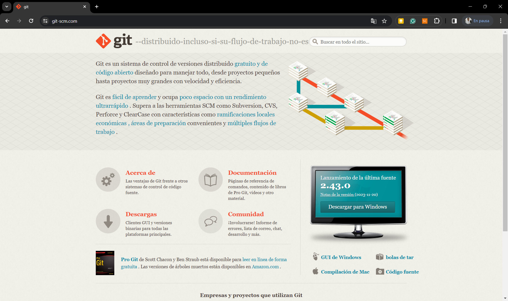
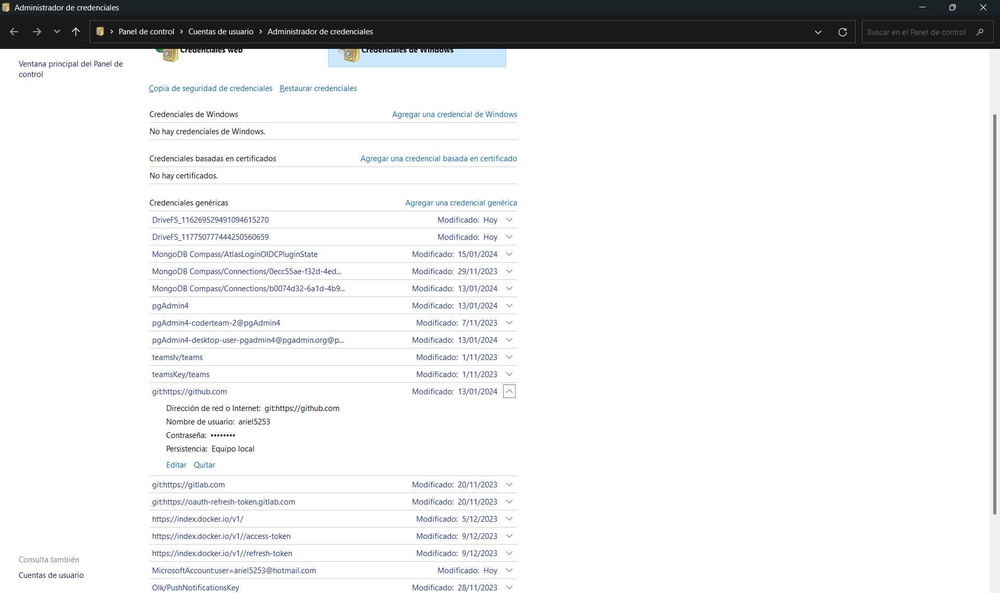
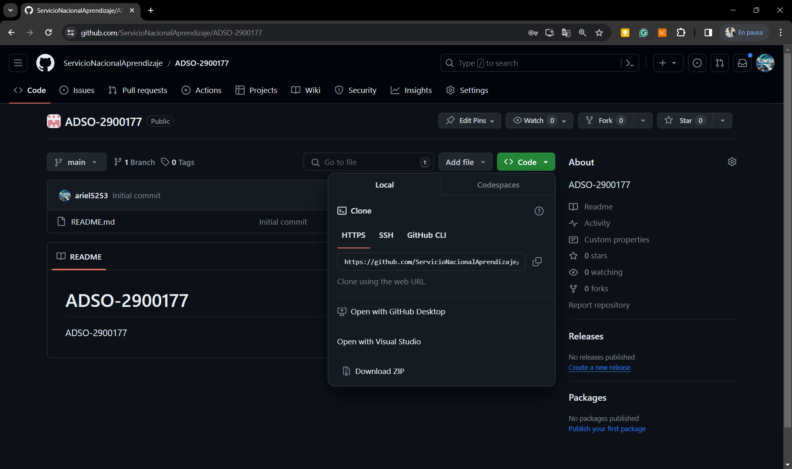

# ADSO-2900177

# Pasos para configurar git

1. Realizar descarga de git: https://git-scm.com/



2. Configurar datos de acceso al github
 ```git 
    git config --global user.name "John Doe"
    git config --global user.email johndoe@example.com
 ```
3. Eliminar datos de autenticación, en caso que desee cambiar la cuenta. 




# Pasos básicos para usar git

1. Cuando solo se tiene acceso de visualización

* Clonar el repositorio


* Obtener los cambios del repositorio
```git
    git pull
```

2. Cuando es colaborador del repositorio y desea realir cambios

```git
    git pull
    git add -A
    git commit -m  "Mensaje de cambio"
    git push
```

- Nota: Use esto de guía para el desarrollo de su actividad. 

